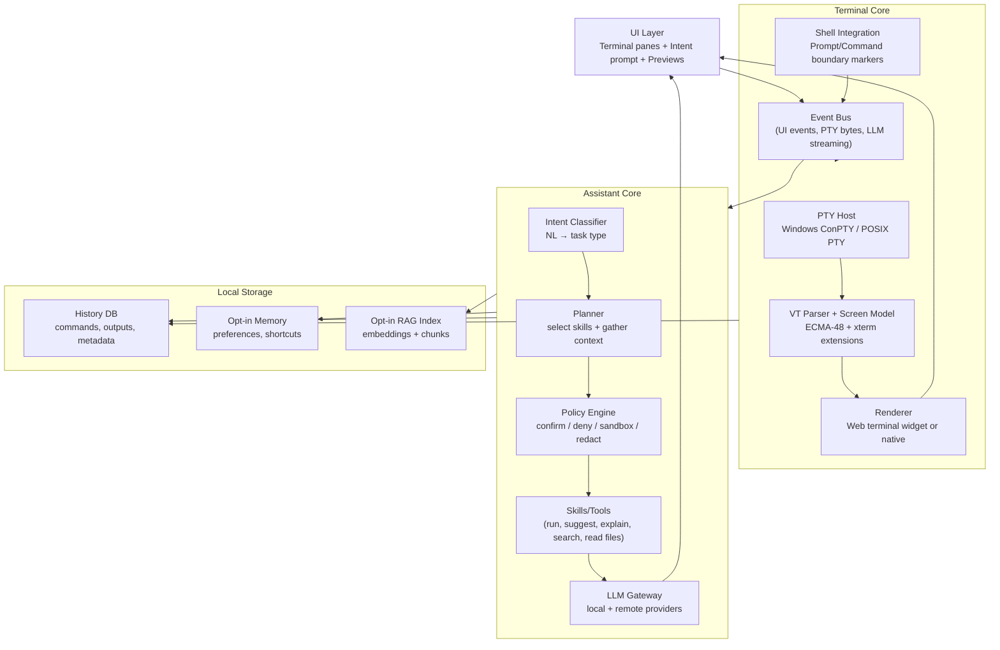
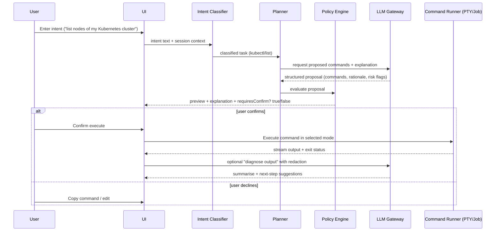
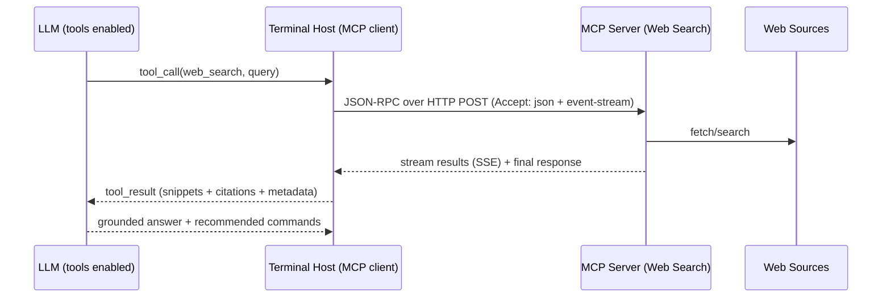

# Designing a Cross-Platform LLM‑Augmented Terminal

## Executive summary

A modern “AI terminal” that remains a first-class terminal emulator (not just a chat UI that sometimes runs commands) has two hard technical cores: **(a) robust PTY-backed process hosting** and **(b) standards‑compatible terminal emulation**. On Windows, the practical baseline is **ConPTY (Windows Pseudoconsole)**, which requires the host to create input/output pipes and service them correctly (often on separate threads to avoid deadlocks) while decoding **virtual terminal (VT) sequences**. citeturn2view0turn3search0 On macOS/Linux, the baseline is **POSIX pseudo-terminals** (e.g., `openpty` / `forkpty`, `posix_openpt`, and `termios`), including correct window-resize signalling (SIGWINCH). citeturn12view0turn0search1turn15search3turn13search1

For the LLM layer, the most robust architecture is to treat the LLM as **a planner + explainer** with **explicit, typed “skills/tools”** (e.g., “propose kubectl command”, “run command”, “read file”, “web search”). This prevents the model from “free-form deciding to execute” and enables strong policy gates (confirmation, privilege checks, redaction, audit logging). MCP (Model Context Protocol) is well aligned to this because it standardises tool exposure and includes explicit security principles (user consent/control, privacy, tool safety) and well-defined transports (stdio or streamable HTTP with origin validation guidance). citeturn18view0turn19view0

A practical recommendation for a first production-quality release is:

- **Terminal core:** PTY-based session hosting everywhere (ConPTY on Windows; PTY on macOS/Linux) with a VT parser/emulator aligned to ECMA-48 and xterm-family sequences. citeturn2view0turn3search0turn3search2turn21view0  
- **Shell integration:** use prompt/command boundary markers from cooperative shell scripts (similar to iTerm2 / VS Code / Windows Terminal) to reliably segment per-command output, capture exit codes, and support command navigation. citeturn20search4turn20search1turn20search13  
- **LLM providers:** default to a local LLM via **Ollama** and optionally route to remote providers via a **gateway/proxy**. Ollama already exposes **OpenAI‑compatible endpoints** (including `/v1/chat/completions` and `/v1/responses`) and supports streaming and tools; it also documents model-aliasing for “default OpenAI model names”. citeturn1view0  
- **Proxy strategy:** adopt a single internal “LLM gateway” abstraction and optionally implement it using an existing OpenAI-compatible gateway like **LiteLLM Proxy**, which can front multiple providers and expose one OpenAI-like surface to your terminal app. citeturn17search6turn17search14  
- **Security posture:** strict confirmation UX for destructive operations; explicit handling for elevation (UAC “runas” on Windows; `sudo` flows on Unix); OS keychain-backed secret storage; and optionally sandbox “auto-run jobs” using AppContainer/App Sandbox/namespaces. citeturn9search1turn9search3turn9search4turn26search0turn26search1turn26search2  
- **Distribution:** Windows MSIX + WinGet; macOS notarised builds + Sparkle; Linux (AppImage/Flatpak/Snap) with careful attention to sandbox constraints for a terminal that must spawn arbitrary host processes. citeturn4search4turn4search1turn4search2turn4search3turn5search0turn5search1turn5search2

## OS integration and terminal fundamentals

A cross-platform terminal/assistant must interact with each OS at multiple layers: **process creation + PTY**, **terminal emulation**, **shell integration**, **filesystem/process APIs**, plus UX-critical OS services (clipboard, drag/drop, accessibility) and distribution/update mechanisms.

### PTY and process hosting

**Windows:** ConPTY (“Windows Pseudoconsole”) is the canonical PTY-like mechanism. The host must create synchronous communication channels (commonly pipes) and pass them to `CreatePseudoConsole`, then create the child process with `CreateProcess` using extended startup info so the child attaches to the pseudoconsole. citeturn2view0 ConPTY documentation explicitly warns about race conditions/deadlocks and recommends servicing each channel on its own thread while draining buffers properly. citeturn2view0 Once connected, the host reads the output pipe, decodes VT sequences, and renders; and writes user input to the input pipe. citeturn2view0

**macOS/Linux:** standard PTY flows are exposed through `openpty`/`forkpty` (or `posix_openpt` + `grantpt` + `unlockpt` + `ptsname`). `openpty` returns master/slave file descriptors; `forkpty` combines PTY allocation and forking, and in the child calls `login_tty` for the slave device. citeturn12view0turn0search1 Terminal line discipline is controlled via `termios` (`tcsetattr` etc.). citeturn13search1turn13search2 Resizing requires updating the PTY window size (e.g., `TIOCSWINSZ`), which triggers SIGWINCH to the foreground process group. citeturn15search3turn15search11

**PTY versus pipes for stdout/stderr capture:** if you run a command in a PTY session, stdout and stderr often both target the same terminal device (the PTY slave), so they become indistinguishable at the host side; the host sees one byte stream. Practically, many “AI terminal” products provide two modes:  
- **Interactive terminal sessions** (PTY): best UX and compatibility with curses/interactive tools, but output is a merged stream.  
- **Non-interactive “jobs”** (pipes): run a single command with stdout/stderr pipes to capture separately, but interactive programs may change behaviour because they are not attached to a TTY (which is exactly why PTY libraries describe their value as “making programs think you’re a terminal” to get control sequences). citeturn15search1

### Terminal emulation and VT/ANSI standards

The practical “dialect” of terminal control sequences in the wild is: **ECMA-48 / ISO 6429 control functions**, plus extensive xterm/DEC-derived extensions. ECMA-48 defines the general model for control functions embedded in text streams. citeturn3search2 The xterm control-sequence reference is an important compatibility target because many modern terminal emulators implement (subsets of) it. citeturn21view0turn23view0

On Windows, Microsoft’s documentation emphasises **Console Virtual Terminal Sequences** as the modern mechanism for cursor control, colour, and other operations when written to the output stream, and notes that sequences can also be received on input in response to queries or in certain modes. citeturn3search0 ConPTY specifically assumes you will **decode VT sequences and render** them yourself. citeturn2view0

Terminal emulation also depends on **terminfo**, which describes terminal capabilities used by software (notably ncurses-based tools). citeturn24search0 Correctly setting and advertising `TERM` and providing an appropriate terminfo entry (or being compatible with common ones like `xterm-256color`) reduces subtle breakage. citeturn24search0turn24search5

### Shell integration for reliable command boundaries

A core UX requirement (“capture stdout/stderr from commands”, “segment output”, “explain pitfalls”, “optionally execute”) is far easier if the terminal can identify **prompt start/end**, **command start**, **output start**, and **command end + exit code**. This is not reliably inferable purely from the byte stream, especially with custom prompts and full-screen apps.

Proven approaches use **cooperative shell scripts**:

- **iTerm2 Shell Integration** works by configuring the shell to emit **special escape codes** that communicate prompt boundaries, command boundaries, last return code, username, host, and current directory. citeturn20search4turn20search0  
- **VS Code shell integration** uses injected scripts to detect commands and enables command navigation and selection of output based on reliable command positions. citeturn20search1turn20search17  
- **Windows Terminal shell integration** similarly relies on shell cooperation to semantically mark “prompt”, “command”, and “output” regions. citeturn20search13

On Unix shells, hooks such as `precmd` and `preexec` in zsh provide an officially documented mechanism to run code before each prompt and before command execution, which underpins integration scripts. citeturn20search3 In PowerShell, PSReadLine’s predictive features and plug-in predictor model can complement your own suggestion UX if you choose deep integration with the shell editor layer. citeturn20search2

image_group{"layout":"carousel","aspect_ratio":"16:9","query":["Windows ConPTY pseudoconsole diagram","iTerm2 shell integration escape codes prompt command output","xterm.js terminal emulator screenshot","WezTerm terminal emulator GPU accelerated screenshot"],"num_per_query":1}

### File system, process, clipboard, drag/drop, accessibility

**File system watching (for “find files containing…”, project awareness, live context):**
- Windows: `ReadDirectoryChangesW` reports changes within a directory. citeturn6search2  
- Linux: `inotify_init` creates an inotify instance and event queue. citeturn6search0  
- macOS: FSEvents provides notifications when a directory hierarchy changes. citeturn6search9  
Cross-platform wrappers exist (e.g., Rust `notify` crate) that select an appropriate implementation per platform. citeturn6search3

**Clipboard:** native APIs differ:
- Windows clipboard programming commonly involves `OpenClipboard`, `EmptyClipboard`, `SetClipboardData`, then `CloseClipboard`. citeturn7search4turn7search0  
- macOS uses `NSPasteboard` as the standard interface. citeturn7search1  

Additionally, many terminals support **OSC 52** to set clipboard/selection data via escape sequences (often base64 encoded), and xterm documents it as “Manipulate Selection Data”, including that such controls may be disabled by configuration. citeturn23view0turn22view2 This is useful for remote sessions (SSH) but must be treated as a security-sensitive feature (clipboard exfiltration/injection).

**Drag and drop:** platform protocols are different:
- Windows uses OLE drag-and-drop via interfaces like `IDropTarget` and formats exposed via `IDataObject`. citeturn8search0  
- macOS uses AppKit drag-and-drop protocols (`NSDraggingDestination`, etc.). citeturn8search1turn8search5  
- Linux depends on display server: X11 commonly uses XDND protocol, while Wayland provides data-sharing primitives for copy/paste and drag-and-drop with `wl_data_source`/`wl_data_offer` sharing via file descriptors. citeturn8search2turn8search7

**Accessibility:** to be usable with assistive technologies:
- Windows: UI Automation relies on providers that expose UI elements and actions. citeturn7search2  
- macOS: NSAccessibility is the primary system-level accessibility API surface (with modern protocol-based options). citeturn7search11turn7search7  

If you implement custom terminal rendering, accessibility often becomes one of the hardest “last 10%” tasks. Many products lean on native controls or web engines that already implement large parts of accessibility semantics, then add careful ARIA and focus/announcement management where applicable.

### Installer and update strategies per OS

**Windows:** MSIX is a modern packaging format; App Installer supports MSIX/MSIXBundle installation and can participate in update flows. citeturn4search4turn4search0 WinGet is the command-line client for Windows Package Manager and supports discover/install/upgrade flows for applications. citeturn4search5turn4search1

**macOS:** distributed (non–App Store) apps signed with Developer ID generally need to be notarised; Apple provides official guidance and APIs for notarisation workflows. citeturn4search2turn4search19 Sparkle is a widely used open-source update framework supporting multiple archive formats and both manual and automatic update flows. citeturn4search3turn4search7

**Linux:** distribution is fragmented; common strategies:
- Flatpak: sandbox permissions and portals can restrict filesystem/device access unless explicitly granted; portals are the preferred bridge to host resources from a sandbox. citeturn5search0turn5search4  
- Snap: strict confinement isolates applications; classic confinement exists for apps needing broad system access. citeturn5search1turn5search5  
- AppImage: update metadata can be embedded to support delta updates, but update behaviour is not “distro-native”. citeturn5search2  

For a terminal that must spawn arbitrary local processes and access user-selected filesystem roots, strict sandbox packaging (Flatpak strict permissions; Snap strict confinement) can become a product constraint you must design around rather than an afterthought. citeturn5search0turn5search1

### Permission and sandbox implications

- Windows elevation uses UAC; Shell launch documentation calls out the `runas` verb prompting for consent/credentials. citeturn9search1turn9search13  
- Windows sandboxing options include AppContainer isolation and Windows Sandbox configuration, each with different goals and integration complexity. citeturn9search3turn9search11  
- macOS App Sandbox restricts an app’s access to system resources and user data based on entitlements. citeturn9search4turn9search0  
- Linux sandboxing building blocks include namespaces and seccomp; seccomp and user namespaces have capability and configuration constraints. citeturn9search2turn9search6turn9search22  

## Cross‑platform technology choices

There is no single “best” stack; terminal emulation plus PTY integration narrows the field quickly. The most important strategy is to **separate the product into layers**: terminal UI/renderer, PTY/process host, LLM gateway, skills/policy engine, storage (history/memory), and optional integrations (SSH/Kubernetes/web search).

### Stack comparison

| Option | Strengths | Key risks / costs | Practical fit for PTY + terminal emulation |
|---|---|---|---|
| Rust core + webview UI (e.g., lightweight wrapper over system webview) | High performance in core, smaller footprint than shipping Chromium; can keep secrets/LLM key material out of UI process; strong packaging/update story with dedicated plugins in some ecosystems. citeturn14search0turn14search4turn14search8 | Webview differences across OS; terminal rendering in webview needs careful performance work (virtualised scrollback, throttling); accessibility/IME edge cases. citeturn14search4 | Very strong: use a proven terminal widget (xterm.js) plus a robust PTY backend (portable-pty). citeturn3search11turn15search0 |
| Electron (Chromium + Node) | Rich ecosystem; xterm.js + node-pty are widely used together; uniform rendering across OS. citeturn3search11turn15search1 | Larger binaries, higher baseline RAM; auto-updates built-in only for macOS/Windows (Linux relies on package managers). citeturn14search2 | Strong for “fast iteration”; proven PTY story via node-pty (Windows ConPTY on newer Windows). citeturn15search9 |
| Native UI (Rust + winit/Skia/Metal/DirectX etc.) | Maximum control; potential best performance; can implement bespoke accessibility semantics. | Very high engineering cost: full terminal rendering, text shaping, IME, accessibility, drag/drop, clipboard, theming; long tail of emulator quirks. | Strong only if you reuse a mature terminal core (e.g., reuse an existing emulator engine) rather than implement from scratch. citeturn24search2 |
| Cross-platform .NET UI | Solid enterprise tooling, strong Windows/macOS story in supported matrices; packaging guidance exists for Windows and Mac Catalyst. citeturn14search3 | Linux desktop support depends on framework choice and may not be first-class in all stacks; high-performance terminal rendering control may be harder. | Feasible with an embedded terminal renderer and a native PTY host, but expect glue work. |
| Go desktop wrappers | Simple deployment model, good concurrency; can embed web UI and keep a small core. | Many PTY libs are Unix-focused; Windows ConPTY wrappers exist but maturity varies; GUI ecosystem is more fragmented. citeturn15search2turn2view0 | Potentially good if you rely on a mature terminal renderer and treat Go as backend. |

A key grounding: ConPTY requires the host to decode VT sequences and render them. citeturn2view0turn3search0 So any “UI stack” must allow efficient incremental screen updates and scrollback handling—either via a proven terminal component or a highly optimised custom renderer.

### PTY libraries

| Language/runtime | Mature option | Platform support notes | Evidence |
|---|---|---|---|
| Rust | `portable-pty` | Advertises a cross-platform PTY API and is used in a production terminal ecosystem (WezTerm). citeturn15search0 | citeturn15search0turn15search4 |
| Node.js | `node-pty` | Provides `forkpty(3)` bindings; supports Windows (ConPTY on newer Windows; legacy fallbacks on older). citeturn15search1turn15search9 | citeturn15search1turn15search9 |
| Go | `github.com/creack/pty` | Unix PTYs; documentation explicitly describes it as Unix PTYs and warns examples are not production-ready without extra handling (deadlines/non-blocking). citeturn15search2turn15search6 | citeturn15search2 |
| Multi-language (C/C++) | native OS APIs | Windows: ConPTY; Unix: openpty/posix_openpt. citeturn2view0turn12view0turn0search1 | citeturn2view0turn12view0 |

### SSH and Kubernetes integration choices

For SSH, you can either:
- Use the **system OpenSSH client** by spawning `ssh` (fastest to implement, inherits user config and keys), or  
- Embed an SSH library (e.g., libssh2/libssh) to control authentication prompts, host key verification UI, multiplexing, and session recording. libssh2 provides documented subsystems (session, userauth, channel, SFTP, etc.). citeturn27search2turn27search10

For Kubernetes, the official documentation lists multiple client libraries across languages and specifically notes you can avoid implementing raw REST calls by using a client library. citeturn27search0turn27search15 The official Go client (`client-go`) is explicitly described as the official Go client for the Kubernetes API. citeturn27search3

A useful product decision is whether your “kubectl skill” should:
- run `kubectl` as a subprocess (matching the user’s configured plugins/auth flows), or  
- call Kubernetes APIs directly (more control, but you must safely implement kubeconfig reading, auth plug-ins, and match kubectl semantics).

### Packaging and auto-update implications for framework choice

Two framework-level realities strongly affect product operations:
- Some stacks have built-in updaters, but platform coverage differs. Electron’s `autoUpdater` explicitly notes built-in support for macOS and Windows and recommends using distribution package managers for Linux. citeturn14search2  
- Some ecosystems emphasise signed updates. For example, Tauri’s updater guidance describes a built-in signature mechanism for safe updates. citeturn14search5turn14search1  

## LLM options and OpenAI‑compatible endpoints

Your LLM strategy must reconcile: latency, cost, privacy, offline support, and “fleet manageability” (enterprise users may want central control). A strong approach is to ship with **local‑first** inference and allow optional routing to cloud providers.

### Local LLM via Ollama

Ollama documents OpenAI compatibility endpoints including:
- `/v1/chat/completions` with chat, streaming, JSON mode, tools, etc. citeturn1view0  
- `/v1/embeddings` for embedding generation. citeturn1view0  
- `/v1/responses` (noted as added in a specific Ollama version) and described as supporting the OpenAI Responses API, but only the **non-stateful** flavour. citeturn1view0  

Ollama also documents practical compatibility tactics:
- Use `base_url='http://localhost:11434/v1/'` with an OpenAI client; it notes an API key value may be required by clients but ignored by Ollama. citeturn1view0  
- If tooling expects default OpenAI model names (e.g., `gpt-3.5-turbo`), Ollama provides a model copy/alias mechanism (`ollama cp`) so that requests specifying that model name resolve locally. citeturn1view0

**Concrete steps to expose OpenAI‑compatible URLs (Ollama local-first):**

1) Pull or create your model:  
```bash
ollama pull llama3.2
```
citeturn1view0

2) Ensure the Ollama server is running (platform-specific service/daemon; defaults commonly expose on port 11434). Then call OpenAI-compatible endpoints. Example (chat completions):  
```bash
curl http://localhost:11434/v1/chat/completions \
  -H "Content-Type: application/json" \
  -d '{
    "model": "llama3.2",
    "messages": [{"role":"user","content":"Explain what kubectl get nodes does."}],
    "stream": false
  }'
```
citeturn1view0

3) If you need to satisfy a client hardcoded to `gpt-3.5-turbo`, alias:  
```bash
ollama cp llama3.2 gpt-3.5-turbo
```
Then use `"model": "gpt-3.5-turbo"` in requests. citeturn1view0

4) If you want OpenAI “Responses API” compatibility for your agent layer, use `/v1/responses` (noting Ollama’s limitation around stateful conversation in that endpoint). citeturn1view0

### Remote LLM via OpenAI API

OpenAI’s platform documentation strongly emphasises:
- **API key secrecy**: do not embed keys in client-side apps; route requests via a backend you control. citeturn16search1turn16search7  
- **Migration towards the Responses API** and explicitly provides a migration guide. citeturn16search0  
- **Rate limits** are defined and documented; you should design for backoff and predictable behaviour under throttling. citeturn25search1turn25search9  
- **Data controls**: OpenAI states that, by default, data sent to the API is not used to train or improve models unless you opt in. citeturn25search2  
- **Pricing is variable by model/tooling** and is documented in official pricing pages (including tool-specific pricing such as web search tool calls). citeturn25search0turn25search4  

### Hybrid setups and “one interface” via an OpenAI‑compatible gateway

A key product simplifier is to enforce **one internal client** and swap `base_url` + authentication:

- Local: `base_url = http://localhost:11434/v1/` (Ollama). citeturn1view0  
- Remote: OpenAI base URL (standard), with your server-side key handling guidance. citeturn16search7turn16search1  

If you want to support multiple upstreams (Ollama + OpenAI + other OpenAI-compatible servers) without rewriting client logic, adopt a gateway such as **LiteLLM Proxy**, described as an OpenAI-compatible gateway to interact with multiple LLM providers through a unified API. citeturn17search6turn17search14

Also note: other common OpenAI-compatible servers include:
- **vLLM** OpenAI-compatible server (Chat API compatible with OpenAI Chat Completions). citeturn17search0turn17search4  
- **llama-cpp-python** OpenAI-compatible web server. citeturn17search1  

This matters because your terminal can treat “OpenAI-compatible” as a class of providers, not a single vendor.

### Optional web search augmentation

There are two main paradigms:

1) **MCP-based web search**: implement a web-search MCP server and let the LLM call it as a tool. MCP formally defines transports:
- **stdio**: the host launches the MCP server as a subprocess; messages are newline-delimited JSON-RPC; stderr may be used for logs. citeturn19view0  
- **Streamable HTTP**: JSON-RPC over HTTP POST/GET with optional SSE streaming; MCP includes explicit security warnings, such as validating `Origin` headers to mitigate DNS rebinding and binding to localhost for local servers. citeturn19view0  

2) **Model-provider web search tool**: OpenAI documents pricing and characteristics of a built-in web search tool (tool calls plus tokens billed). citeturn25search4  

Recommendation: treat web search as **a privileged tool** (explicit UI indication, citations shown to users, and configurable allow/deny policies), aligning with MCP’s consent-centric security principles. citeturn18view0turn19view0

## LLM skill architecture, memory, and RAG

A terminal assistant becomes truly useful when it behaves less like “chat” and more like a **reliable workflow engine**. The safest way there is not “prompt engineering only”, but **a tool/skill framework** with typed inputs/outputs and policy gating.

### Skill model: intent → plan → propose → (optional) execute → explain

A robust loop:

1) **Intent parsing**: classify the user’s natural language into an action type (e.g., “explain”, “suggest”, “run read-only command”, “run potentially destructive command”, “needs clarification”).  
2) **Context assembly**: gather minimal necessary context: current shell, current directory, repo/cluster context hints, recent command history, environment variables (selectively), and relevant files.  
3) **Command synthesis**: generate commands as structured data (AST-like objects), not plain text, to enable policy checks and rendering of a safe preview.  
4) **Policy evaluation**: require confirmation for risky actions; detect secrets; enforce allowlists/denylists; apply sandboxing if enabled.  
5) **Execution**: run via PTY session or job runner; stream outputs; parse exits; summarise failures.  
6) **Explanation**: annotate the command(s), flags, pitfalls, and rollback/undo suggestions.

Shell integration markers can materially improve step (5) by letting you bracket command output and capture the exit code more reliably than heuristics. citeturn20search4turn20search1turn20search13

### Streaming: two streams, two parsers

You are typically streaming:
- **Terminal output**: bytes from PTY/pipes into a VT parser and then into a screen model. Windows explicitly expects the host to decode VT sequences when using ConPTY. citeturn2view0turn3search0  
- **LLM output**: token-by-token (or chunked) responses, plus tool-call events in function-calling styles.

Recommendation: treat these as distinct event buses so your UI can render terminal output with strict ordering while LLM commentary streams in parallel (but is anchored to a command/job boundary).

### Memory and RAG: when to use what

In terminals, “memory” is high-risk because by default it may capture secrets, tokens, private paths, or proprietary repository content. A strong design is:

- **Session context (always on, ephemeral):** last N commands, last M KB of output per command, current working directory, shell type, and lightweight project metadata.  
- **User-approved long-term memory (opt-in):** preferences (“always ask before delete”), frequently used clusters, preferred package manager, naming conventions, etc. Store as small structured records, not raw transcripts.

For deeper help (“explain this error”, “what does this kubeconfig mean”), use **RAG** when the needed knowledge is in:
- local files and docs (README, Helm values, CI logs)  
- long outputs or multi-command traces  
- vendor documentation that changes over time (web search)

Embeddings are a standard way to enable semantic retrieval: OpenAI describes embeddings as vector representations useful for search and related tasks. citeturn16search20turn16search2

**Practical RAG guidance for terminals:**
- Chunk and index *selected* corpora (project docs, command outputs you explicitly label as safe, your own skill docs, and optionally manpages).  
- Keep retrieval “small”: retrieve only the few most relevant chunks and show the user what is being sent to the model.  
- Prefer local embedding generation when using a local LLM stack; otherwise, use an embeddings API endpoint with a strict redaction layer. citeturn16search2turn16search5  
- Avoid indexing entire home directories by default; instead use a “roots” model (scoped directories) and explicit user selection, mirroring MCP’s “Roots” concept and consent emphasis. citeturn18view0

### Privacy-by-design in prompts and context

OpenAI’s guidance emphasises keeping API keys out of client-side apps; the same principle generalises: keep **secrets and raw sensitive data** out of prompts by default. citeturn16search1turn16search7

Practical mitigations:
- redact common secret patterns (tokens, PEM blocks, kubeconfig auth blocks) before sending to cloud models;  
- prefer local models for “paste logs and diagnose” scenarios;  
- store audit logs locally and encrypt where feasible.

## Security, sandboxing, and execution controls

A terminal that can run arbitrary commands with LLM assistance is effectively an automation tool with the ability to damage systems if misused or prompt-injected. Your architecture should treat *all external text* (terminal output, web pages, repo files) as potentially adversarial.

### Threat model highlights

- **Prompt injection via terminal output:** a command prints “Run rm -rf …” or “export your env” and the model treats it as instructions.  
- **Prompt injection via web search results:** malicious pages that instruct the model to exfiltrate secrets or execute dangerous commands. MCP explicitly calls out security and trust & safety concerns because of “arbitrary data access and code execution paths,” and requires explicit user consent flows and careful tool safety handling. citeturn18view0  
- **Credential leakage:** tokens in environment variables or config files; accidental inclusion in model context or logs.  
- **Privilege escalation misuse:** model suggests `sudo` or Windows elevation unnecessarily.

### Execution policy and confirmation UX

A security-credible terminal assistant usually implements a layered policy:

- **Default = suggest, not execute.**  
- **Auto-run only “read-only” commands** that match a safe allowlist (e.g., `git status`, `kubectl get`, `ls`, `cat` on user-selected files).  
- **Always confirm** destructive or state-changing operations (delete, overwrite, apply, upgrade, install, `kubectl delete/apply`, `docker system prune`, package manager installs).  
- **Always confirm** commands involving privilege escalation (`sudo`, `runas` elevation). On Windows, launching as Administrator via `runas` triggers UAC prompts. citeturn9search1turn9search13  
- **Show a diff-style preview** where possible (e.g., for file edits or `kubectl apply --dry-run=server` workflows—implemented as a suggestion until the user confirms).

### Sandboxing options per OS

**Windows:** AppContainer provides a sandbox model that isolates processes and windows and can prevent a contained process from affecting other processes. citeturn9search3 Windows Sandbox exists as a separate disposable environment configurable via `.wsb`. citeturn9search11 Practical recommendation: reserve AppContainer/Windows Sandbox for “untrusted automation jobs” rather than normal interactive shells, since terminals often need broad access.

**macOS:** App Sandbox restricts access based on entitlements and is designed to limit damage if compromised. citeturn9search4turn9search0 A fully sandboxed terminal may face significant constraints (filesystem and process execution policies), so decide early whether you target App Store distribution (sandbox constraints) or notarised non-sandbox distribution.

**Linux:** namespaces and seccomp are foundational isolation primitives; seccomp requires appropriate privileges/capabilities and interacts with user namespaces and no-new-privs settings. citeturn9search2turn9search6 If you distribute as Flatpak/Snap, the packaging sandbox itself becomes your default boundary: Flatpak emphasises restricted permissions and portals. citeturn5search0turn5search4 Snap strict confinement “runs in complete isolation” with limited host access unless interfaces are granted; classic confinement is for apps needing broad access. citeturn5search1turn5search5

### Secrets handling

Storing provider keys, kubeconfig tokens, SSH private key passphrases, and “session macros” requires OS-native secret storage:

- Windows: Credential Manager APIs such as `CredWrite` store credentials associated with the user’s logon session. citeturn26search0  
- macOS: Keychain Services offers APIs such as `SecKeychainAddGenericPassword` for generic passwords, and Apple documents Keychain Services as an encrypted database for small bits of user data. citeturn26search1turn26search13  
- Linux desktop: Secret Service API is a freedesktop.org specification; libsecret is a common client library communicating with the Secret Service over D-Bus. citeturn26search2turn26search3turn26search7  

Your own logs/history store should support **redaction** (store “command template” without secrets) and **selective persistence** (e.g., “never store outputs from commands matching these patterns”).

### MCP/web tool security

If you use MCP servers over HTTP, MCP’s transport spec explicitly warns:
- validate `Origin` header to mitigate DNS rebinding  
- bind local servers to localhost  
- implement proper authentication for all connections. citeturn19view0  

These aren’t “nice-to-haves”; they are directly relevant because your terminal will likely run local MCP servers (web search, filesystem indexing) on the same machine.

## UX patterns for an LLM‑augmented terminal

Good UX prevents the “AI layer” from feeling like an intrusive chatbot and instead makes it feel like a productivity accelerator.

### Input modes and interaction patterns

A robust pattern is a **dual input model**:
- **Terminal input** (normal shell typing) remains untouched.  
- **Intent input** (natural language) is a distinct modality: a dedicated prompt line, a hotkey overlay, or a prefix trigger (e.g., starting a line with a special token) that routes to the assistant.

This avoids confusing shell syntax with natural language and supports predictable behaviour (e.g., you never accidentally send “please list nodes…” into bash).

### Suggestion UX that users trust

Key patterns:
- **Command preview + explanation** before execution.  
- **Inline annotations**: highlight risky flags, show what a command will do, and provide a rollback path (e.g., “dry run first”, “use `--server-side --dry-run`”, “use `git restore`”).  
- **One-click “copy command”** even when auto-run is enabled (so users can choose to run manually).  
- **Output summarisation anchored to boundaries**: use shell integration markers for per-command output ranges and exit status. citeturn20search4turn20search1turn20search13  

For PowerShell users, consider integration with PSReadLine predictions, but keep it optional; PSReadLine’s predictor model supports plug-in modules for advanced suggestions. citeturn20search2

### Multi-pane, history, session recording, collaboration

A terminal power-user baseline typically includes:
- panes/tabs;  
- searchable scrollback;  
- command-aware history;  
- session recording/export.

If you add LLM assistance, make it first-class in history:
- store “intent → proposed commands → executed commands → outputs → explanation” as a single artefact, so users can replay or share.  
- clearly label whether a command was auto-run, user-confirmed, or only suggested.

Collaboration features (shared sessions, remote pair debugging) should be approached cautiously because they expand the threat model (commands executed on behalf of others, sensitive outputs streaming). If implemented, default to “read-only sharing” and use redaction.

### Clipboard and drag/drop UX

- Support native copy/paste reliably via OS APIs. citeturn7search4turn7search1  
- Consider OSC 52 as an advanced feature for remote sessions, but ship it behind a security toggle because xterm documents selection manipulation as a control that may be disabled and it can be abused for clipboard injection. citeturn23view0turn22view2  
- Drag/drop should support dropping files into the terminal (insert escaped paths) and dropping text into the intent prompt (summarise/ask what to do). Platform protocols vary widely, so leverage framework support where possible. citeturn8search0turn8search1turn8search7  

## Implementation plan and reference designs

This section provides a concrete component model, APIs, data flows, mermaid diagrams, milestones, testing, CI/CD, telemetry/privacy, and example skill/prompt templates. It assumes an open-ended budget/team size and therefore gives scalable milestones.

### Component breakdown

A scalable architecture splits into five primary subsystems:

**Terminal subsystem**
- PTY host (ConPTY / POSIX PTY)
- input encoder (keyboard/mouse → VT input sequences)
- VT parser + screen model
- renderer (web or native)
- shell integration manager (optional scripts + marker decoding)

**Assistant subsystem**
- LLM gateway (provider abstraction)
- skills registry + tool schemas
- intent classifier + planner
- policy engine (confirmations, deny rules, sandbox routing)
- output tutor (explain commands, pitfalls)

**Integrations subsystem**
- filesystem indexer + watchers
- SSH connector (optional)
- Kubernetes connector (optional)
- web search tool (MCP server or provider tool)
- secrets manager (OS keychain integration)

**Storage subsystem**
- history store (commands + outputs + metadata)
- session store (multi-pane/session records)
- memory store (opt-in)
- RAG index (opt-in / per-root)

**Operations subsystem**
- updater
- telemetry (opt-in)
- crash reporting (opt-in)
- audit logs

### Architecture diagram



Key grounding constraints referenced in this diagram:
- ConPTY requires host-managed channels and VT decoding/rendering. citeturn2view0turn3search0  
- Terminal/clipboard features like OSC 52 exist but may be disabled and are security sensitive. citeturn23view0turn22view2  
- MCP provides standardised tool integration with explicit security/consent emphasis. citeturn18view0turn19view0  

### Sequence flows

**Natural-language intent → suggestion → optional execution (with confirmation):**


**MCP web search tool call (Streamable HTTP) as augmentation:**


The MCP transport layer and its security requirements (Origin validation; localhost binding) are explicitly defined in the MCP spec. citeturn19view0turn18view0

### Milestones and estimated effort

Effort varies massively by scope, but a realistic staged plan:

**Milestone A: terminal MVP (interactive shell, stable rendering)**
- ConPTY + POSIX PTY hosting
- VT parser + renderer
- tabs/panes, scrollback, copy/paste
- basic packaging per OS (no auto-update yet)

**Milestone B: assistant MVP (suggest and explain, no auto-run by default)**
- LLM gateway (local Ollama via OpenAI-compatible endpoints)
- skills: `git`, `kubectl`, `find/grep`, package manager suggesters, `docker` suggesters
- command previews, explanations, and safe defaults

**Milestone C: safe execution + auditing**
- execution policies and confirmation UI
- “job runner” mode (stdout/stderr separated) for non-interactive tasks
- audit log + redaction + secret scanning

**Milestone D: RAG + optional web search**
- embeddings + local vector index (opt-in)
- MCP client + one MCP server (web search) with strict permission gating

**Milestone E: auto-update and enterprise hardening**
- Windows: MSIX/App Installer + WinGet publish pipeline. citeturn4search4turn4search0turn4search1  
- macOS: notarisation + Sparkle updates. citeturn4search2turn4search3  
- Linux: pick primary distribution method(s) and document sandbox constraints (Flatpak/Snap) or ship AppImage. citeturn5search0turn5search1turn5search2  

For a small team (2–4 engineers), Milestones A–C typically dominate time because terminal emulation reliability, IME, and cross-platform PTY behaviour tend to surface edge cases late. (This estimate is experiential rather than a sourced claim.)

### Testing strategy

A credible testing plan for an AI terminal must include both “classic terminal correctness” and “assistant safety”:

- **Terminal correctness**
  - VT sequence conformance tests (golden screen states)
  - resizing tests (SIGWINCH behaviour on Unix; buffer resizing on Windows)
  - stress tests: huge outputs, many panes, rapid writes/reads
  - integration tests running common full-screen apps

- **Process/PTY reliability**
  - deadlock regression tests (ConPTY channel servicing and drain behaviour) aligned with Microsoft’s warnings about deadlocks when not servicing channels properly. citeturn2view0  
  - process-tree cleanup tests on exit (no orphaned shells)

- **Assistant safety**
  - policy unit tests (commands classified correctly, confirmations enforced)
  - prompt-injection fixtures (terminal output containing malicious instructions)
  - secrets redaction tests
  - “no auto-run” invariants unless allowlisted

- **Web/MCP safety**
  - Origin validation tests and localhost binding for MCP HTTP servers. citeturn19view0  
  - tool permission prompts required by design, aligning with MCP’s consent expectations. citeturn18view0  

### CI/CD and release

A robust release pipeline usually includes:
- build matrix (Windows/macOS/Linux), signed artefacts, notarisation for macOS. citeturn4search2  
- SBOM generation and dependency scanning (especially if you embed web engines or LLM runtimes)  
- update metadata publishing (Sparkle appcast; MSIX update channel; Linux release artefacts). citeturn4search3turn4search0turn5search2  

### Telemetry and privacy posture

Given the sensitivity of terminal content:
- default telemetry should be **off** or minimal and clearly described;  
- diagnostic bundles should be user-generated and scrubbed/redacted by default;  
- if using remote LLMs, clearly label what content leaves the machine, consistent with the “your data is your data” controls expectation and key-safety guidance. citeturn25search2turn16search1  

### Example skill definitions and prompt templates

Below are illustrative (tool-driven) skill definitions. Your implementation can represent these as JSON Schema tool definitions (OpenAI Responses style) or MCP tools. MCP explicitly models “tools” as functions a model can execute. citeturn18view0turn19view0

#### Skill definition template

```yaml
skill: kubectl_list_nodes
description: List nodes in the current Kubernetes context.
inputs:
  intent_text: string
  kube_context_hint: string|null
  namespace_hint: string|null
  allow_execute: boolean
outputs:
  proposal:
    commands: [string]
    explanation_md: string
    risk_level: { enum: [read_only, changes_state, destructive, privilege_required] }
    requires_confirmation: boolean
    followups: [string]
policies:
  default_action: suggest
  auto_execute_if:
    - risk_level == read_only
    - allow_execute == true
    - user_has_enabled_auto_run_readonly == true
  require_confirmation_if:
    - risk_level != read_only
```

#### Prompt template: command synthesis (general)

```text
System:
You are a terminal assistant. You must produce a structured proposal, not free-form commands.
Never assume you can execute. Default is to suggest.
If a command is risky, mark it as requires_confirmation and explain why.
If information is missing, ask a single, specific question.

User intent: {{intent_text}}

Context:
- OS: {{os}}
- Shell: {{shell}}
- CWD: {{cwd}}
- Detected tools: {{tools_available}}
- User settings: {{execution_policy_summary}}

Return JSON with:
{
  "commands": ["..."],
  "risk_level": "read_only|changes_state|destructive|privilege_required",
  "requires_confirmation": true|false,
  "explanation_md": "...",
  "pitfalls": ["..."],
  "alternatives": ["..."]
}
```

#### Domain-specific examples and “run vs suggest” guidance

**Git**
- Suggest by default; auto-run read-only like `git status`, `git diff`, `git log`.  
- Always confirm for history rewriting (`rebase`, `reset --hard`, force push).

Example prompt specialisation:
```text
User intent: {{intent_text}}
Repo context:
- git_status: {{git_status_output}}
- current_branch: {{branch}}
- remote: {{remote}}
Rules:
- If command rewrites history or deletes changes, require confirmation and propose a safer alternative first.
```

**kubectl**
- Auto-run candidates: `kubectl get ...`, `kubectl describe ...` (read-only).  
- Confirm: `apply`, `delete`, `scale`, `rollout restart`.

**find/grep**
- Auto-run candidates: search-only commands scoped to selected roots.
- Confirm: commands that delete or rewrite content (e.g., `sed -i`, `perl -pi`, `find -delete`).

**Package managers**
- Always confirm installs/upgrades/removals.
- Prefer “show” commands first (e.g., `apt-cache`, `brew info`, `winget show`) then propose install.

Windows packaging ecosystem is explicitly documented through WinGet and MSIX resources; if you create a “package manager” skill, it can be OS-aware (WinGet on Windows). citeturn4search5turn4search1

**Docker**
- Auto-run candidates: `docker ps`, `docker images`, `docker logs` (read-only).  
- Confirm: `docker rm`, `docker system prune`, destructive volume operations.

#### Example: Ollama local-first + proxy to OpenAI

A concrete deployment pattern:

- Ship the desktop app with a local provider configuration pointing to Ollama OpenAI-compatible endpoints (`http://localhost:11434/v1/`). citeturn1view0  
- Offer an optional “Cloud provider” configuration routed through your backend (never embed cloud keys in the desktop client). citeturn16search1turn16search7  
- Optionally support a local gateway (LiteLLM Proxy) so the desktop app always talks to one OpenAI-like base URL, and the proxy routes to Ollama or OpenAI. LiteLLM explicitly positions itself as an OpenAI-compatible gateway. citeturn17search6turn17search14  

This gives you:
- offline-first operation
- centralised policy enforcement (proxy can enforce budgets, model allowlists)
- a single client implementation in the terminal.

#### Technology comparison tables for quick reference

**Distribution/update strategies (practical “default picks”)**

| OS | Recommended primary distribution | Auto-update strategy | Notes |
|---|---|---|---|
| Windows | MSIX + WinGet listing | App Installer/MSIX update channel; optionally store-based updates | App Installer supports MSIX installation; WinGet supports install/upgrade flows. citeturn4search0turn4search1 |
| macOS | Notarised DMG/ZIP | Sparkle | Apple requires notarisation for many Developer ID distributed apps; Sparkle supports multiple archive formats and configurable auto-update flows. citeturn4search2turn4search3 |
| Linux | AppImage (broad compatibility) + optional Flatpak | AppImage embedded update info; Flatpak via repo updates | Flatpak and Snap introduce sandbox constraints; AppImage is simpler but less “integrated”. citeturn5search2turn5search0turn5search1 |

**Terminal clipboard options**

| Mechanism | Works where | Pros | Security considerations |
|---|---|---|---|
| Native clipboard APIs | Windows/macOS/Linux | Most reliable; consistent with user expectations. citeturn7search4turn7search1 | Requires correct permission handling and good UX; may interact with OS privacy mechanisms. |
| OSC 52 | Many terminal emulators supporting xterm-like sequences | Enables remote clipboard set via escape sequences; useful over SSH. citeturn23view0turn22view2 | Clipboard injection/exfiltration risks; must be user-controlled and auditable. |

